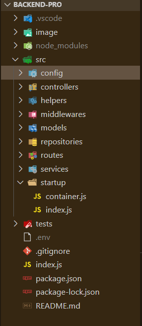
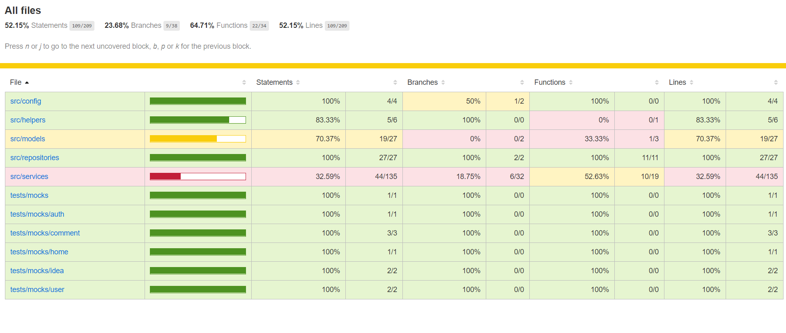

# ***Backend Nodejs  - Architecture***

### Es necesario tener instalado la última versión estable de [*Node*](https://nodejs.org/en/) y también la última versión estable de [Mongodb](https://www.mongodb.com/download-center/community).

#### Reconstruir módulos de Node :
```
npm i
```
#### Actualizar dependencias :
```
npm update
```
#### Levantar el servidor en desarrollo:
```
npm run dev
```
#### Levantar pruebas unitarias:
```
npm run test
```
#### Levantar coverage de pruebas:
Esto te generara un archivo coverage , ingresas a coverage/lcov-report/index.html y lo abres en tu navegador para poder ver de una manera mas amigable y didáctica el test realizado.
```
npm run test:coverage-all
```
#### Levantar el servidor en producción :
```
npm start
```

> ***Imagen referencial :***




- *Importante:* Crear el fichero de variables de entorno
***Creamos el fichero .env en el  directorio raiz***
```
PORT=<número-puerto>
MONGO_URI=mongodb://localhost:27017/<base-de-datos>
APPLICATION_NAME=<nombre-aplicación>
JWT_SECRET=<palabra-clave>
EXPIRES_IN=<tiempo-expiración>
CACHE_KEY=<cache-key>
SWAGGER_DOC=<swaggerDEV>
```
***Para ver la documentación echa con Swagger :***
Puedes configurar todo lo relacionado con el swagger en src/config/swagger/swaggerDEV.json o el src/config/swagger/swaggerPROD.json dependiendo de lo que necesites generar.
- http://localhost:3001/api-docs/

***Para ver el coverage de las pruebas realizadas con Jest en coverage/lcov-report/index.html:***



> Juan Diego Falcón Córdova ( ***Web Developer*** - :computer::man: )
