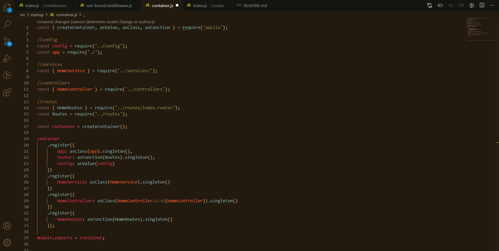

# ***Backend Nodejs  - Architecture***

### Es necesario tener instalado la última versión estable de [*Node*](https://nodejs.org/en/) y también la última versión estable de [Mongodb](https://www.mongodb.com/download-center/community).

#### Reconstruir módulos de Node :
```
npm i
```
#### Actualizar dependencias :
```
npm update
```
#### Levantar el servidor en desarrollo:
```
npm run dev
```
#### Levantar el servidor en producción :
```
npm start
```

> ***Imagen referencial :***



- *Importante:* Crear el fichero de variables de entorno
***Creamos el fichero .env en el  directorio raiz***
```
PORT=<número-puerto>
MONGO_URI=mongodb://localhost:27017/<base-de-datos>
APPLICATION_NAME=<nombre-aplicación>
```
> Juan Diego Falcón Córdova ( ***Web Developer*** - :computer::man: )
